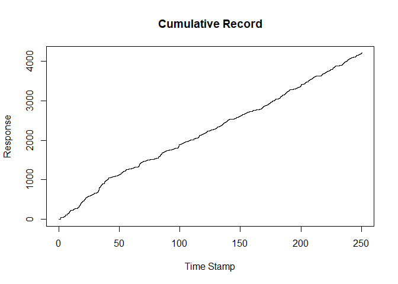

<!-- README.md is generated from README.Rmd. Please edit that file -->

# Lab.Data.Prep

<!-- badges: start -->

[](https://github.com/jessjorge/Lab.Data.Prep/actions/workflows/R-CMD-check.yaml)
<!-- badges: end -->

The Lab Data Prep package is designed to streamline some common
laboratory data prep tasks for researchers utilizing Med-PC software.
Med-PC data is delivered in a format that is difficult to understand and
work with; however, many of the data cleaning tasks are routine. This
package consolidates these routine tasks into a few simple functions
that can be called with ease, and provides a plotting utility function
to use after data cleanup. What formerly took a few hundred lines of
code is now just a few function calls away.

## Installation

You can install the development version of Lab.Data.Prep from
[GitHub](https://github.com/) with:

``` r
# install.packages("devtools")
devtools::install_github("jessjorge/Lab.Data.Prep")
```

## Example

To import Med-PC data files, the **extract()** function can be called.
This function is designed to extract files for a single experiment where
all subjects have a common prefix. If subjects do not share a common
prefix, the function can be called for individual subjects. The subject
number prefix is supplied as the first argument, in this case “EB”. The
subject id numbers can be supplied as either a single numeric, or a
vector of numeric to extract multiple subjects. Lastly, the location of
the data files are supplied in a filepath argument. **extract()**
returns an r data frame for each mpc file with no change to the original
formatting.

``` r
library(Lab.Data.Prep)

# Extract files with a given subject number
subs <- extract("EB",11,paste(system.file("extdata", package = "Lab.Data.Prep"),"/", sep = ""))
```

In the current example, we call the **mpc()** function on the **subs**
list generated from the **extract()** function. The **mpc()** function
takes as arguments a list of data files for a single subject and an
array of interest from the original data file. In this case, the **“d”**
array has been selected. Below is a snippet of the **“d”** array. The
number before the decimal place is a timestamp in centiseconds, and the
second number is a unique event identifier.

``` r
subs[[1]][1]
#> $`!2020-03-10_08h31m.Subject EB11.txt`
#>                      File..C..MED.PC.IV.DATA..2020.03.10_08h31m.Subject.EB11
#> 1                                                       Start Date: 03/10/20
#> 2                                                         End Date: 03/10/20
#> 3                                                              Subject: EB11
#> 4                                                        Experiment: MagThin
#> 5                                                                   Group: 2
#> 6                                                                     Box: 1
#> 7                                                       Start Time:  8:31:27
#> 8                                                         End Time:  8:56:31
#> 9                                                               MSN: MagThin
#> 10                                                            G:       0.000
#> 11                                                            H:       0.000
#> 12                                                            I:       0.000
#> 13                                                            J:       0.000
#> 14                                                            K:       0.000
#> 15                                                            L:       0.000
#> 16                                                            M:       0.000
#> 17                                                            N:       0.000
#> 18                                                            O:       0.000
#> 19                                                            P:       0.000
#> 20                                                            Q:       0.000
#> 21                                                            R:       0.000
#> 22                                                            S:       0.000
#> 23                                                            T:       0.000
#> 24                                                            U:       0.000
#> 25                                                            V:       0.000
#> 26                                                            W:       0.000
#> 27                                                            X:       0.000
#> 28                                                            Y:       0.000
#> 29                                                            Z:       0.000
#> 30                                                                        A:
#> 31       0:        2.000        6.000        6.000       15.000        0.000
#> 32       5:    60000.000       11.000     1000.000        0.000        9.000
#> 33      10:        7.000       10.000       12.000        0.000        0.000
#> 34                                                          15:        0.000
#> 35                                                                        B:
#> 36       0:      434.000      735.000        1.000    60000.000    95140.000
#> 37       5:      279.000       12.000        0.000        0.000        0.000
#> 38      10:       91.000       28.000      168.000        0.000      775.500
#> 39      15:     1000.000        0.000       28.000      127.000        0.000
#> 40                                                          20:        0.000
#> 41                                                                        C:
#> 42       0:      126.100      127.200      347.300      998.300     1154.300
#> 43       5:     2302.300     2643.100     2716.300     2746.300     2903.300
#> 44      10:     3259.300     3283.300     3492.300     3567.100     3568.200
#> 45      15:     3897.100     3932.100     4009.300     4047.300     4174.300
#> 46      20:     4197.300     4428.100     4429.200     4431.100     4500.100
#> 47      25:     4614.300     4794.100     4886.300     5056.100     5062.100
#> 48      30:     5078.100     5091.100     5110.100     5166.300     5210.300
#> 49      35:     5323.100     5338.100     5347.100     5352.100     5408.300
#> 50      40:     5438.300     5566.100     5581.100     5590.100     5605.100
#> 51      45:     5623.100     5628.100     5678.300     5716.300     5831.100
#> 52      50:     5842.100     5853.100     5857.100     5866.100     5882.100
#> 53      55:     5892.100     5907.100     5955.300     6158.100     6162.100
#> 54      60:     6172.100     6183.100     6197.100     6209.100     6267.300
#> 55      65:     6283.300     6592.100     6620.100     6678.300     6749.100
#> 56      70:     6927.100     6961.100     6972.100     7020.300     7051.300
#> 57      75:     7113.300     7529.300     9964.300    10026.100    10027.200
#> 58      80:    10111.300    10193.300    10239.300    10398.300    10426.300
#> 59      85:    10726.300    10754.300    10859.100    10860.200    11060.100
#> 60      90:    11189.300    11232.300    11341.300    11410.100    11411.200
#> 61      95:    11577.100    11719.100    11833.300    12052.100    12084.100
#> 62     100:    12166.300    12326.100    12327.200    12507.300    12781.300
#> 63     105:    12867.300    12893.300    13052.100    13370.300    13555.300
#> 64     110:    13594.300    13756.300    14047.100    14048.200    14107.100
#> 65     115:    14235.300    14324.300    14435.100    14483.300    14517.300
#> 66     120:    14585.300    14759.300    14789.300    14863.100    14876.100
#> 67     125:    14949.300    15004.300    15117.100    15128.100    15194.300
#> 68     130:    15203.300    15268.300    15447.100    15539.100    15599.300
#> 69     135:    15626.300    15681.300    15804.100    15811.100    15817.100
#> 70     140:    15856.300    16349.300    16663.100    16664.200    16746.300
#> 71     145:    16820.100    16821.200    17355.100    17525.100    17648.300
#> 72     150:    17800.100    17819.100    17940.100    17958.100    18026.100
#> 73     155:    18027.200    18037.300    18343.100    18475.300    18511.300
#> 74     160:    18887.100    18972.300    19074.100    19088.100    19121.100
#> 75     165:    19129.100    19133.100    19212.300    19398.100    19411.100
#> 76     170:    19423.100    19427.100    19494.300    19521.300    19636.100
#> 77     175:    19651.100    19663.100    19684.100    19694.100    19700.100
#> 78     180:    19714.100    19778.300    19926.100    19939.100    19953.100
#> 79     185:    19961.100    19978.100    19991.100    20005.100    20017.100
#> 80     190:    20033.100    20097.300    20169.300    20355.100    20356.200
#> 81     195:    20404.100    20515.300    20544.300    20659.100    20718.100
#> 82     200:    20778.100    20841.300    20944.100    20945.200    22082.100
#> 83     205:    22083.200    22182.100    22277.100    22471.100    22472.200
#> 84     210:    23034.100    23090.100    23280.100    23354.300    23450.100
#> 85     215:    23460.100    23468.100    23486.100    23569.100    23585.100
#> 86     220:    23590.100    23605.100    23613.100    23679.300    23685.300
#> 87     225:    24019.100    24039.100    24050.100    24067.100    24074.100
#> 88     230:    24080.100    24124.300    24272.100    24291.100    24303.100
#> 89     235:    24323.100    24336.100    24405.300    24503.100    24571.100
#> 90     240:    24646.100    24755.300    24787.300    26198.300    26255.300
#> 91     245:    26471.300    26728.300    26893.100    26894.200    26917.300
#> 92     250:    27082.100    27165.300    27217.300    27325.100    27342.100
#> 93     255:    27354.100    27366.100    27439.300    27543.100    27570.100
#> 94     260:    27588.100    27629.100    27664.100    27680.100    27701.100
#> 95     265:    27754.300    27859.100    27860.200    27946.100    28177.100
#> 96     270:    28344.100    28424.100    28506.300    28622.100    28638.100
#> 97     275:    28651.100    28668.100    28681.100    28860.100    28901.100
#> 98     280:    28928.100    28937.100    28966.100    29035.300    29230.100
#> 99     285:    29231.200    29502.100    29661.100    29684.100    29716.100
#> 100    290:    29746.100    29864.300    30003.100    30029.100    30040.100
#> 101    295:    30055.100    30082.100    30098.100    30113.100    30134.100
#> 102    300:    30195.300    30296.100    30346.100    30365.100    30371.100
#> 103    305:    30379.100    30393.100    30398.100    30418.100    30432.100
#> 104    310:    30482.100    30549.100    30559.100    30598.100    30607.100
#> 105    315:    30658.300    30894.100    30990.100    31003.100    32430.100
#> 106    320:    32453.100    32461.100    32471.100    32477.100    32539.300
#> 107    325:    32608.300    32788.100    32810.100    32831.100    32837.100
#> 108    330:    32852.100    32954.100    32970.100    32989.100    33002.100
#> 109    335:    33008.100    33019.100    33039.100    33056.100    33171.300
#> 110    340:    33235.100    33297.100    33310.100    33319.100    33521.100
#> 111    345:    33736.100    34070.300    36150.100    36151.200    36195.100
#> 112    350:    36464.100    36749.300    36791.300    37124.100    37382.100
#> 113    355:    37471.100    37492.100    38486.100    38487.200    39959.100
#> 114    360:    39960.200    40225.100    40963.100    40964.200    41133.100
#> 115    365:    41617.100    41734.100    41880.100    42028.300    42712.100
#> 116    370:    42713.200    42835.100    43409.100    43585.100    43769.100
#> 117    375:    43804.100    43850.100    43982.100    44224.100    44275.100
#> 118    380:    44291.100    44315.100    44697.100    44833.100    44930.100
#> 119    385:    44954.100    44985.100    46418.300    47336.100    47478.100
#> 120    390:    47487.100    47494.100    47512.100    47583.300    49738.100
#> 121    395:    49739.200    49952.100    50515.100    50584.100    50821.100
#> 122    400:    50875.100    50888.100    51044.100    51076.100    51097.100
#> 123    405:    51172.100    51184.100    51256.300    51961.100    52143.100
#> 124    410:    52178.100    52191.100    52268.300    53377.100    53378.200
#> 125    415:    54228.100    54229.200    55532.100    55533.200    57435.300
#> 126    420:    57502.300    57974.300    58119.300    58213.300    58684.100
#> 127    425:    58685.200    58699.300    58763.300    58974.300    59468.300
#> 128                 430:    59556.300    59749.100    59987.300    59997.300
#> 129                                                                       D:
#> 130      0:        0.111      126.200      127.500      127.510      177.510
#> 131      5:      227.510      239.710      277.510      327.510      377.510
#> 132     10:      578.710     1382.520     1602.700     2253.700     2409.700
#> 133     15:     3557.700     3898.200     3971.700     4001.700     4158.700
#> 134     20:     4514.700     4538.700     4747.700     4822.200     4823.500
#> 135     25:     4823.510     4873.510     4916.710     4923.510     4959.710
#> 136     30:     4973.510     5023.510     5073.510     5499.710     5644.710
#> 137     35:     5686.710     5795.710     5801.710     5824.710     5923.710
#> 138     40:     6078.520     6407.200     6442.200     6519.700     6557.700
#> 139     45:     6684.700     6707.700     6938.200     6939.500     6939.510
#> 140     50:     6989.510     7011.710     7039.510     7089.510     7139.510
#> 141     55:     7189.510     7293.710     7318.710     7814.710     7845.710
#> 142     60:     7944.710     7969.710     8194.520     8196.200     8265.200
#> 143     65:     8379.700     8559.200     8651.700     8821.200     8827.200
#> 144     70:     8843.200     8856.200     8875.200     8931.700     8975.700
#> 145     75:     9088.200     9103.200     9112.200     9117.200     9173.700
#> 146     80:     9203.700     9331.200     9346.200     9355.200     9370.200
#> 147     85:     9388.200     9393.200     9443.700     9481.700     9596.200
#> 148     90:     9607.200     9618.200     9622.200     9631.200     9647.200
#> 149     95:     9657.200     9672.200     9720.700     9923.200     9927.200
#> 150    100:     9937.200     9948.200     9962.200     9974.200    10032.700
#> 151    105:    10048.700    10357.200    10385.200    10443.700    10514.200
#> 152    110:    10692.200    10726.200    10737.200    10785.700    10816.700
#> 153    115:    10878.700    11294.700    13729.700    13791.200    13792.500
#> 154    120:    13792.510    13823.210    13842.510    13892.510    13937.710
#> 155    125:    13942.510    13992.510    14042.510    14283.710    14320.710
#> 156    130:    14762.710    15047.520    15131.700    15213.700    15259.700
#> 157    135:    15418.700    15446.700    15746.700    15774.700    15879.200
#> 158    140:    15880.500    15880.510    15930.510    15960.710    15980.510
#> 159    145:    16030.510    16080.510    16130.510    16840.710    17135.520
#> 160    150:    17335.200    17464.700    17507.700    17616.700    17685.200
#> 161    155:    17686.500    17686.510    17736.510    17775.710    17786.510
#> 162    160:    17836.510    17886.510    17936.510    18797.710    18828.710
#> 163    165:    18941.520    19107.200    19249.200    19363.700    19582.200
#> 164    170:    19614.200    19696.700    19856.200    19857.500    19857.510
#> 165    175:    19907.510    19932.710    19957.510    20007.510    20057.510
#> 166    180:    20107.510    20614.710    20642.710    21112.520    21292.700
#> 167    185:    21566.700    21652.700    21678.700    21837.200    22155.700
#> 168    190:    22340.700    22379.700    22541.700    22832.200    22833.500
#> 169    195:    22833.510    22845.210    22876.710    22883.510    22892.710
#> 170    200:    22933.510    22983.510    23033.510    23083.510    23697.210
#> 171    205:    23940.710    23967.710    24016.710    24088.520    24147.200
#> 172    210:    24275.700    24364.700    24475.200    24523.700    24557.700
#> 173    215:    24625.700    24799.700    24829.700    24903.200    24916.200
#> 174    220:    24989.700    25044.700    25157.200    25168.200    25234.700
#> 175    225:    25243.700    25308.700    25487.200    25579.200    25639.700
#> 176    230:    25666.700    25721.700    25844.200    25851.200    25857.200
#> 177    235:    25896.700    26389.700    26703.200    26704.500    26704.510
#> 178    240:    26754.510    26804.510    26806.710    26854.510    26904.510
#> 179    245:    26954.510    27338.710    27506.210    27715.710    27744.710
#> 180    250:    27823.710    27959.520    28041.700    28115.200    28116.500
#> 181    255:    28116.510    28166.510    28190.710    28216.510    28266.510
#> 182    260:    28316.510    28366.510    29371.520    29905.200    30075.200
#> 183    265:    30198.700    30350.200    30369.200    30490.200    30508.200
#> 184    270:    30576.200    30577.500    30577.510    30627.510    30648.710
#> 185    275:    30677.510    30727.510    30777.510    30827.510    31338.710
#> 186    280:    31352.710    31807.710    31832.520    31842.700    32148.200
#> 187    285:    32280.700    32316.700    32692.200    32777.700    32879.200
#> 188    290:    32893.200    32926.200    32934.200    32938.200    33017.700
#> 189    295:    33203.200    33216.200    33228.200    33232.200    33299.700
#> 190    300:    33326.700    33441.200    33456.200    33468.200    33489.200
#> 191    305:    33499.200    33505.200    33519.200    33583.700    33731.200
#> 192    310:    33744.200    33758.200    33766.200    33783.200    33796.200
#> 193    315:    33810.200    33822.200    33838.200    33902.700    33974.700
#> 194    320:    34160.200    34161.500    34161.510    34177.210    34211.510
#> 195    325:    34236.710    34261.510    34311.510    34361.510    34411.510
#> 196    330:    35056.710    35114.710    35327.210    35416.520    35464.200
#> 197    335:    35575.700    35604.700    35719.200    35778.200    35838.200
#> 198    340:    35901.700    36004.200    36005.500    36005.510    36055.510
#> 199    345:    36103.710    36105.510    36155.510    36205.510    36255.510
#> 200    350:    37260.520    38397.200    38398.500    38398.510    38448.510
#> 201    355:    38463.710    38498.510    38548.510    38598.510    38648.510
#> 202    360:    39606.710    39653.520    39752.200    39847.200    40041.200
#> 203    365:    40042.500    40042.510    40092.510    40099.710    40134.710
#> 204    370:    40142.510    40192.510    40242.510    40292.510    41297.520
#> 205    375:    41859.200    41915.200    42105.200    42179.700    42275.200
#> 206    380:    42285.200    42293.200    42311.200    42394.200    42410.200
#> 207    385:    42415.200    42430.200    42438.200    42504.700    42510.700
#> 208    390:    42844.200    42864.200    42875.200    42892.200    42899.200
#> 209    395:    42905.200    42949.700    43097.200    43116.200    43128.200
#> 210    400:    43148.200    43161.200    43230.700    43328.200    43396.200
#> 211    405:    43471.200    43580.700    43612.700    45023.700    45080.700
#> 212    410:    45296.700    45553.700    45718.200    45719.500    45719.510
#> 213    415:    45769.510    45790.710    45819.510    45869.510    45919.510
#> 214    420:    45969.510    46428.210    46718.710    46767.710    46867.210
#> 215    425:    46933.210    46974.520    46997.700    47162.200    47245.700
#> 216    430:    47297.700    47405.200    47422.200    47434.200    47446.200
#> 217    435:    47519.700    47623.200    47650.200    47668.200    47709.200
#> 218    440:    47744.200    47760.200    47781.200    47834.700    47939.200
#> 219    445:    47940.500    47940.510    47990.510    48040.510    48068.710
#> 220    450:    48090.510    48140.510    48190.510    49195.520    49281.200
#> 221    455:    49512.200    49679.200    49759.200    49841.700    49957.200
#> 222    460:    49973.200    49986.200    50003.200    50016.200    50195.200
#> 223    465:    50236.200    50263.200    50272.200    50301.200    50370.700
#> 224    470:    50565.200    50566.500    50566.510    50616.510    50666.510
#> 225    475:    50670.710    50716.510    50766.510    50816.510    51404.210
#> 226    480:    51700.710    51713.710    51732.710    51784.710    51821.520
#> 227    485:    52092.200    52251.200    52274.200    52306.200    52336.200
#> 228    490:    52454.700    52593.200    52619.200    52630.200    52645.200
#> 229    495:    52672.200    52688.200    52703.200    52724.200    52785.700
#> 230    500:    52886.200    52936.200    52955.200    52961.200    52969.200
#> 231    505:    52983.200    52988.200    53008.200    53022.200    53072.200
#> 232    510:    53139.200    53149.200    53188.200    53197.200    53248.700
#> 233    515:    53484.200    53580.200    53593.200    55020.200    55043.200
#> 234    520:    55051.200    55061.200    55067.200    55129.700    55198.700
#> 235    525:    55378.200    55400.200    55421.200    55427.200    55442.200
#> 236    530:    55544.200    55560.200    55579.200    55592.200    55598.200
#> 237    535:    55609.200    55629.200    55646.200    55761.700    55825.200
#> 238    540:    55887.200    55900.200    55909.200    56111.200    56326.200
#> 239    545:    56660.700    58740.200    58741.500    58741.510    58766.210
#> 240    550:    58791.510    58841.510    58857.710    58891.510    58941.510
#> 241    555:    58991.510    59585.710    59769.210    59887.710    59996.520
#> 242    560:    60040.200    60309.200    60594.700    60636.700    60969.200
#> 243    565:    61227.200    61316.200    61337.200    62331.200    62332.500
#> 244    570:    62332.510    62382.510    62432.510    62482.510    62483.710
#> 245    575:    62532.510    62582.510    63587.520    65059.200    65060.500
#> 246    580:    65060.510    65110.510    65160.510    65166.710    65210.510
#> 247    585:    65260.510    65310.510    66315.520    66580.200    67318.200
#> 248    590:    67319.500    67319.510    67369.510    67403.710    67419.510
#> 249    595:    67469.510    67488.710    67496.710    67519.510    67569.510
#> 250    600:    68574.520    68743.200    69227.200    69344.200    69490.200
#> 251    605:    69638.700    70322.200    70323.500    70323.510    70373.510
#> 252    610:    70423.510    70431.710    70473.510    70523.510    70573.510
#> 253    615:    71578.520    71700.200    72274.200    72450.200    72634.200
#> 254    620:    72669.200    72715.200    72847.200    73089.200    73140.200
#> 255    625:    73156.200    73180.200    73562.200    73698.200    73795.200
#> 256    630:    73819.200    73850.200    75283.700    76201.200    76343.200
#> 257    635:    76352.200    76359.200    76377.200    76448.700    78603.200
#> 258    640:    78604.500    78604.510    78654.510    78701.710    78704.510
#> 259    645:    78741.710    78754.510    78804.510    78854.510    79430.710
#> 260    650:    79466.710    79750.710    79806.710    79821.710    79859.520
#> 261    655:    80072.200    80635.200    80704.200    80941.200    80995.200
#> 262    660:    81008.200    81164.200    81196.200    81217.200    81292.200
#> 263    665:    81304.200    81376.700    82081.200    82263.200    82298.200
#> 264    670:    82311.200    82388.700    83497.200    83498.500    83498.510
#> 265    675:    83548.510    83572.710    83598.510    83648.510    83698.510
#> 266    680:    83748.510    84384.710    84425.710    84462.710    84753.520
#> 267    685:    85603.200    85604.500    85604.510    85654.510    85695.710
#> 268    690:    85704.510    85754.510    85804.510    85854.510    86859.520
#> 269    695:    88162.200    88163.500    88163.510    88213.510    88263.510
#> 270    700:    88290.710    88313.510    88363.510    88413.510    89418.520
#> 271    705:    91320.700    91387.700    91859.700    92004.700    92098.700
#> 272    710:    92569.200    92570.500    92570.510    92620.510    92657.710
#> 273    715:    92670.510    92720.510    92770.510    92820.510    93112.710
#> 274    720:    93201.710    93221.710    93433.710    93771.710    93807.710
#> 275    725:    93825.520    93839.700    93903.700    94114.700    94608.700
#> 276    730:    94696.700    94889.200    95127.700    95137.700    95140.999
#> 277                                                                       E:
#> 278      0:        5.200       16.300       28.800       43.200       59.900
#> 279      5:       80.100      105.300      139.300      191.600      330.300
#> 280                                                                       F:
#> 281                                0:        0.000        0.000        0.000
```

This package is designed to handle arrays that store timestamps with
associated event tags as shown above.

``` r
# Call mpc to create a med pc
df <- mpc(subs[[1]], "d")
```

The new dataframe has 9 unique, undefined event tags. Each of these
numbers corresponds to a unique event type, which will be defined by a
practitioner in the form of an R dictionary.

``` r
unique(df$event_tags)
#> [1] 0.111 0.2   0.5   0.51  0.71  0.52  0.7   0.21  0.999
#> Levels: 0.111 0.2 0.21 0.5 0.51 0.52 0.7 0.71 0.999
```

A dictionary in R looks a lot like a vector, but each element consists
of a key and a value, separated by an equals sign. The user should
define this dictionary as follows and pass it into the var_def function.
var_def will take the dictionary and create a new dummy variable (1’s &
0’s) column named after each value.

``` r
# Event type = Event Name
vars <- c(
  "0.111" = "Rat Earns LSD",
  "0.2" = "Rat Turned Into a Butterfly",
  "0.5" = "Rat Fights Snake, Loses",
  "0.51" = "Rat Fights Snake, Wins",
  "0.71" = "Rat Literacy Tests",
  "0.52" = "Water Spiked with Strawberry Wine"
)

new_df <- var_def(df, vars, cumulative = TRUE)
```

Now we take a look at the new dataframe. var_def has created binary
variables for each element of the vars dictionary. At each time_stamp,
if the event of interest occurred there is a 1 in the corresponding
column. If cumulative = TRUE, an additional column for each variable
will be created to track running totals of events at each time point.

``` r
head(new_df)
#>   session time_stamps   id Rat Earns LSD Rat Turned Into a Butterfly
#> 1       1  0.00000000 EB11             1                           0
#> 2       1  0.02100000 EB11             0                           1
#> 3       1  0.02116667 EB11             0                           0
#> 4       1  0.02116667 EB11             0                           0
#> 5       1  0.02950000 EB11             0                           0
#> 6       1  0.03783333 EB11             0                           0
#>   Rat Fights Snake, Loses Rat Fights Snake, Wins Rat Literacy Tests
#> 1                       0                      0                  0
#> 2                       0                      0                  0
#> 3                       1                      0                  0
#> 4                       0                      1                  0
#> 5                       0                      1                  0
#> 6                       0                      1                  0
#>   Water Spiked with Strawberry Wine Rat Earns LSD  (cumulative)
#> 1                                 0                           1
#> 2                                 0                           1
#> 3                                 0                           1
#> 4                                 0                           1
#> 5                                 0                           1
#> 6                                 0                           1
#>   Rat Turned Into a Butterfly  (cumulative)
#> 1                                         0
#> 2                                         1
#> 3                                         1
#> 4                                         1
#> 5                                         1
#> 6                                         1
#>   Rat Fights Snake, Loses  (cumulative) Rat Fights Snake, Wins  (cumulative)
#> 1                                     0                                    0
#> 2                                     0                                    0
#> 3                                     1                                    0
#> 4                                     1                                    1
#> 5                                     1                                    2
#> 6                                     1                                    3
#>   Rat Literacy Tests  (cumulative)
#> 1                                0
#> 2                                0
#> 3                                0
#> 4                                0
#> 5                                0
#> 6                                0
#>   Water Spiked with Strawberry Wine  (cumulative)
#> 1                                               0
#> 2                                               0
#> 3                                               0
#> 4                                               0
#> 5                                               0
#> 6                                               0
```

Now we run **select()** to grab the columns that we want for plotting.
Because rats earned a lot of LSD, we are grabbing the “Rat Earned Some
LSD (cumulative)” variable. Note that the variable name must be typed
exactly, and there are **two spaces** between the *variable name* and
the *(cumulative)* component.

``` r
isolate <- select(new_df, "Gave Rat Some LSD  (cumulative)")
```

Now the data has been transformed and is suitable for cummulative record
generation.

``` r
head(isolate)
#>      time_stamps value
```

All that’s left is to plot!


